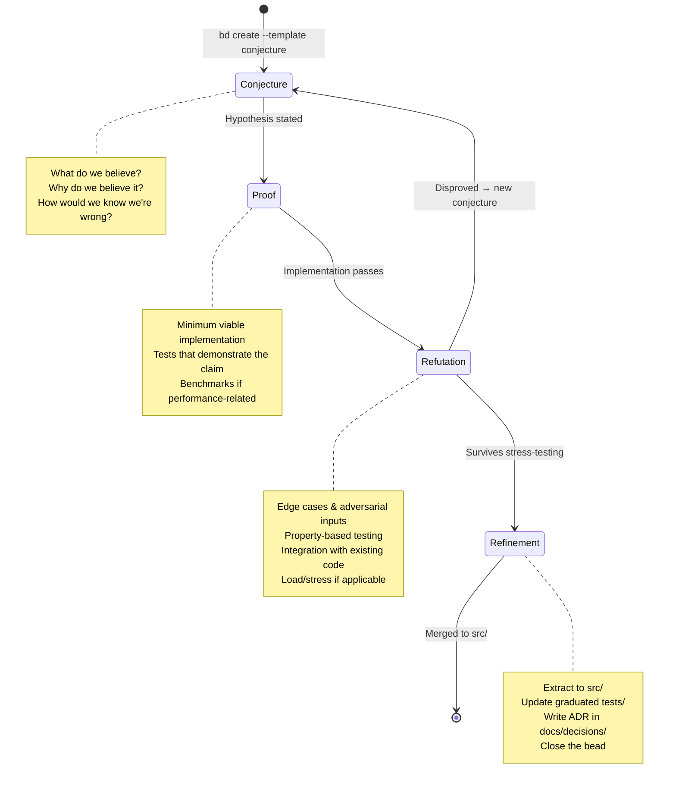
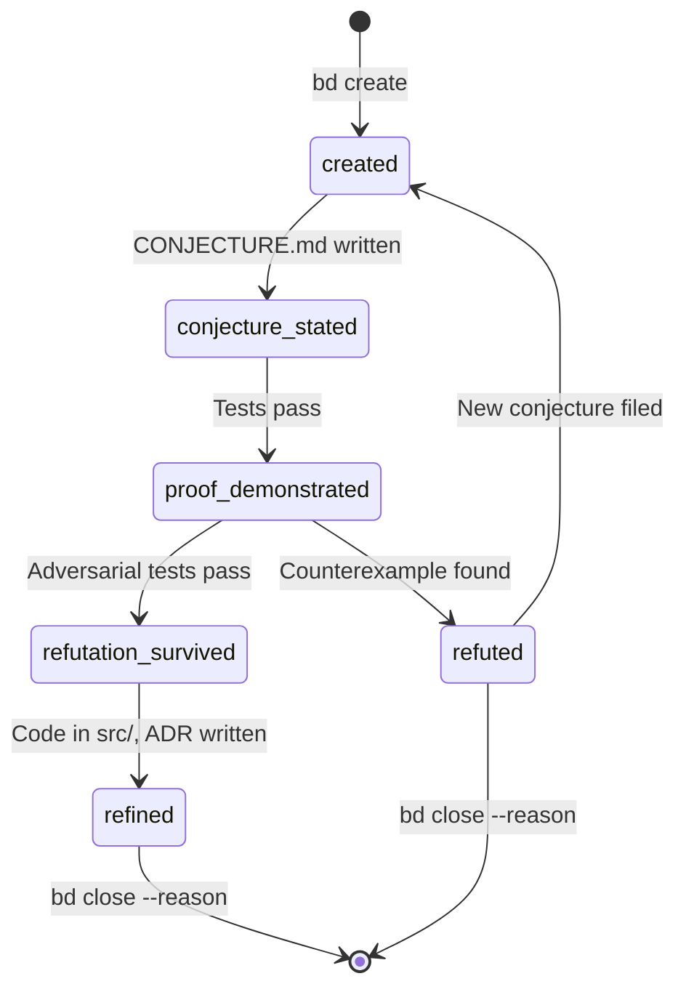

# AGENTS.md — CPRR Methodology

> **Conjecture → Proof → Refutation → Refinement**
>
> Every change begins as a conjecture.  Your job is to _disprove it_
> before promoting it.  What survives refutation gets refined into the
> codebase.  What doesn't gets documented so nobody wastes time on it
> again.

This file governs how coding agents operate in this repository.
Read it completely before writing any code.

---

## Core Principles

1. **No code without a conjecture.**  Every change addresses a stated
   hypothesis in `experiments/NNN-name/CONJECTURE.md`.
2. **No merge without a proof.**  The proof is a passing test suite,
   benchmark, or demonstration that the conjecture holds.
3. **Refutation is the goal, not the failure mode.**  Actively try to
   break your own conjecture.  Document what you find.
4. **Refinement preserves the audit trail.**  Never delete a failed
   experiment.  Mark it `REFUTED` and explain why.
5. **Beads track state.**  Every experiment has a bead.  Every phase
   transition updates the bead.

---

## Project Layout

```
.
├── AGENTS.md                    # ← You are here
├── .beads/                      # Bead tracking (bd)
│   ├── config.toml              # Bead configuration
│   └── templates/               # CPRR phase templates
│       ├── conjecture.toml
│       ├── proof.toml
│       ├── refutation.toml
│       └── refinement.toml
├── experiments/                  # Experiment-driven development
│   ├── README.md                # Index of all experiments
│   ├── 000-quickstart/          # Seed: verify toolchain
│   │   ├── CONJECTURE.md
│   │   ├── PROOF.md
│   │   ├── REFUTATION.md
│   │   ├── REFINEMENT.md
│   │   ├── Makefile
│   │   └── src/
│   └── NNN-description/         # Your experiments
├── src/                         # Production code (refined survivors)
├── tests/                       # Graduated test suite
└── docs/
    └── decisions/               # ADRs for refinements that land
```

---

## The CPRR Cycle



---

## Phase 1: Conjecture

### What You Do

1. Create a numbered experiment directory:
   ```bash
   # Find the next number
   NEXT=$(printf "%03d" $(( $(ls -d experiments/[0-9]* 2>/dev/null | wc -l) )))
   mkdir -p experiments/${NEXT}-my-hypothesis
   ```

2. Create a bead to track it:
   ```bash
   bd create --template conjecture "experiments/${NEXT}-my-hypothesis"
   ```

3. Write `CONJECTURE.md` with this structure:

   ```markdown
   # Conjecture: [Short Title]

   ## Hypothesis
   [One sentence: "We believe that X because Y."]

   ## Motivation
   [Why does this matter? What problem does it solve?]

   ## Falsification Criteria
   [How would we know this is WRONG? Be specific.]
   - If [condition], the conjecture is refuted.
   - If [metric] exceeds [threshold], the conjecture is refuted.

   ## Prior Art
   [What experiments or external work informed this?]
   - experiments/NNN-related-thing (if applicable)
   - [external reference]

   ## Scope
   [What is IN scope and what is explicitly OUT of scope?]
   ```

4. Update the bead status:
   ```bash
   bd status <bead-id> conjecture-stated
   ```

### Agent Rules for Conjecture Phase

- **DO** search the experiments/ directory for related prior work first.
- **DO** check `.beads/` for any REFUTED experiments on similar topics.
- **DO NOT** write any implementation code yet.
- **DO NOT** create a conjecture that lacks falsification criteria.
- **DO NOT** scope a conjecture that requires more than ~2 hours of proof work.
  Split it into sub-conjectures instead.

---

## Phase 2: Proof

### What You Do

1. Implement the minimum code that demonstrates the conjecture holds:
   ```
   experiments/NNN-name/
   ├── src/          # Implementation
   ├── tests/        # Tests proving the claim
   ├── Makefile      # Build & test automation
   └── PROOF.md      # What was built & how to run it
   ```

2. Write `PROOF.md`:
   ```markdown
   # Proof: [Experiment Title]

   ## Implementation Summary
   [What was built and why this approach was chosen.]

   ## How to Verify
   ```bash
   cd experiments/NNN-name
   make test       # Run the proof
   make bench      # Run benchmarks (if applicable)
   ‍```

   ## Test Matrix
   | Test              | Status | Notes                    |
   |-------------------|--------|--------------------------|
   | happy-path        | PASS   |                          |
   | empty-input       | PASS   |                          |
   | large-input       | PASS   | <100ms for 10k records   |

   ## Assumptions
   [What are you assuming that could be wrong?]
   ```

3. Update the bead:
   ```bash
   bd status <bead-id> proof-demonstrated
   ```

### Agent Rules for Proof Phase

- **DO** write tests FIRST (TDD within the experiment).
- **DO** keep the implementation contained in `experiments/NNN/src/`.
- **DO** use the project's existing dependencies; don't introduce new ones
  without documenting why in PROOF.md.
- **DO NOT** optimize.  Correctness only.
- **DO NOT** modify anything outside `experiments/NNN/`.
- **DO NOT** skip writing the Makefile.  Every experiment must be
  independently buildable and testable.

---

## Phase 3: Refutation

### What You Do

This is the critical phase.  Your job is to **break your own proof**.

1. Adversarial testing:
   ```bash
   # Property-based testing (Python example)
   # Add to experiments/NNN/tests/
   pytest --hypothesis-seed=0 tests/test_properties.py
   ```

2. Write `REFUTATION.md`:
   ```markdown
   # Refutation Attempts: [Experiment Title]

   ## Edge Cases Tested
   | Case                  | Result   | Notes                         |
   |-----------------------|----------|-------------------------------|
   | null/empty input      | SURVIVED |                               |
   | unicode boundary      | SURVIVED |                               |
   | concurrent access     | REFUTED  | Race condition in cache layer |
   | input > 2GB           | SURVIVED | Streams correctly             |

   ## Property-Based Testing
   [What properties were tested? How many examples?]

   ## Integration Testing
   [Does it work with existing code in src/?]

   ## Verdict
   - [ ] SURVIVED — proceed to Refinement
   - [ ] REFUTED — document failure, file new conjecture or close
   - [ ] PARTIAL — survived with caveats (list them)
   ```

3. Update the bead:
   ```bash
   # If survived:
   bd status <bead-id> refutation-survived

   # If refuted:
   bd status <bead-id> refuted
   bd close <bead-id> --reason "Race condition in cache layer; see REFUTATION.md"
   ```

### Agent Rules for Refutation Phase

- **DO** use property-based testing (Hypothesis for Python, QuickCheck
  for Haskell/Scheme, fast-check for JS).
- **DO** test integration with the actual codebase, not just in isolation.
- **DO** try to violate every assumption listed in PROOF.md.
- **DO** document ALL refutation attempts, including ones that failed to
  refute.
- **DO NOT** fix bugs found during refutation in-place.  Document them
  in REFUTATION.md and decide whether to patch-and-continue or file a
  new conjecture.
- **DO NOT** skip this phase.  "It works on my examples" is not survival.

---

## Phase 4: Refinement

### What You Do

Only experiments that SURVIVED refutation reach this phase.

1. Extract proven code into the production tree:
   ```bash
   # Move implementation to src/
   cp -r experiments/NNN/src/module_name src/

   # Graduate tests
   cp experiments/NNN/tests/test_module.py tests/

   # Ensure everything passes from the root
   make test
   ```

2. Write `REFINEMENT.md`:
   ```markdown
   # Refinement: [Experiment Title]

   ## What Landed
   [Which files moved to src/ and tests/]

   ## What Changed During Refinement
   [Any modifications made during extraction — interface changes,
   naming conventions, integration adjustments]

   ## Decision Record
   [Link to docs/decisions/NNNN-title.md]

   ## Hardening Level Achieved
   - [x] L0: Working code (Proof phase)
   - [x] L1: Example-based tests (Proof phase)
   - [x] L2: Property-based tests (Refutation phase)
   - [ ] L3: Runtime contracts
   - [ ] L4: Formal verification
   ```

3. Write an ADR:
   ```bash
   # Create Architecture Decision Record
   cat > docs/decisions/$(date +%Y%m%d)-NNN-experiment-title.md << 'EOF'
   # ADR: [Title]

   ## Status: Accepted

   ## Context
   [Why was this experiment run?]

   ## Decision
   [What was decided based on the experiment results?]

   ## Consequences
   [What changes as a result?]

   ## Evidence
   - Experiment: experiments/NNN-name/
   - Bead: <bead-id>
   EOF
   ```

4. Close the bead:
   ```bash
   bd close <bead-id> --reason "Refined into src/; see REFINEMENT.md"
   ```

### Agent Rules for Refinement Phase

- **DO** ensure all graduated tests pass from the project root.
- **DO** update any existing code that now depends on the new module.
- **DO** write the ADR — this is not optional.
- **DO NOT** add functionality beyond what was proven in the experiment.
- **DO NOT** refactor unrelated code during refinement.
- **DO NOT** delete the experiment directory.  It is the audit trail.

---

## Bead Lifecycle

Every experiment maps to a bead with this state machine:



### Quick Reference

```bash
# Start a new experiment
bd create --template conjecture "NNN-name"

# Check what's in flight
bd ls --status conjecture-stated,proof-demonstrated

# Find refuted experiments (institutional memory)
bd ls --status refuted

# See the full history of an experiment
bd log <bead-id>
```

---

## Experiment Naming Conventions

```
experiments/
├── 000-quickstart/              # Always first: verify toolchain
├── 001-hypothesis-name/         # Use kebab-case
├── 002-related-followup/        # Sequential numbering
├── 003-alternative-approach/    # Even if 001 was refuted
└── ...
```

Rules:
- **Three-digit prefix**: `000` through `999`.
- **Kebab-case description**: `NNN-short-descriptive-name`.
- **Never reuse numbers**: If `005` is refuted, `006` gets the next idea.
- **Never delete**: Refuted experiments stay.  They are negative knowledge.

---

## Hardening Levels (Elenctic Scale)

Each experiment should declare its target hardening level and achieved level:

| Level | Name              | Artifact                        | When to Use                      |
|-------|-------------------|---------------------------------|----------------------------------|
| L0    | Vibe code         | "It works on my machine"        | Never (this is what we're fixing)|
| L1    | Example-tested    | Unit tests from known cases     | Proof phase minimum              |
| L2    | Property-tested   | Hypothesis/QuickCheck           | Refutation phase minimum         |
| L3    | Contract-guarded  | Runtime pre/post conditions     | Production-critical paths        |
| L4    | Formally verified | Lean4/Z3/Racket contracts       | Safety-critical or financial     |

Agents MUST achieve at least L2 before requesting refinement.

---

## Agent Behavioral Rules

### General

- Read this entire file before starting work.
- Search `experiments/` and `bd ls --status refuted` before proposing
  any new conjecture.  Someone may have already tried it.
- Commit frequently within your experiment directory.
- Never modify `src/` during Conjecture, Proof, or Refutation phases.
- If your context window is filling up, persist state to the experiment's
  `PROOF.md` or `REFUTATION.md` and reference the bead ID for continuity.

### On Getting Stuck

If you cannot complete a phase:
1. Document where you are in the appropriate `.md` file.
2. Update the bead with a note: `bd note <bead-id> "Blocked on X"`
3. Do NOT attempt to skip phases.

### On Discovering Existing Solutions

If JITIR or manual search reveals that the conjecture is already solved:
1. Reference the existing solution in `CONJECTURE.md` under Prior Art.
2. Close the bead: `bd close <bead-id> --reason "Already solved in src/module"`
3. Move on.

---

## Initializing CPRR in a New Project

```bash
# Run the scaffolding script
bash scripts/cprr-init.sh

# Or use bd quickstart
bd quickstart
# Then apply CPRR templates:
cp .beads/templates/*.toml .beads/templates/  # (done by init script)
```
